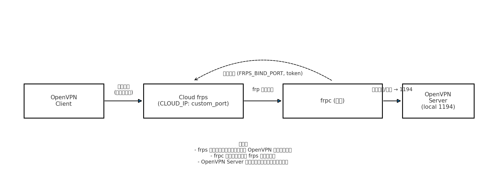

# Frp+OpenVPN部署

## 一、架构概览

外部 OpenVPN 客户端 → 云公网 IP（自定义端口）→ `frps`（云端）→ `frpc`（内网）→ 本机 OpenVPN 服务（内网容器/进程）。



------

## 二、环境配置

### 1.SSH配置

 **Ubuntu20.04 一键配置 SSH 的脚本**，包含安装、配置、用户创建、防火墙放行等步骤。

``` bash
#!/bin/bash
# Ubuntu 20.04 一键配置 SSH 脚本

# 配置项
SSH_PORT=22           # 修改 SSH 端口（建议改为非 22，如 2222）
NEW_USER="devuser"    # 新用户名
ALLOW_PASSWORD_LOGIN="yes"  # 是否允许密码登录（yes/no）

echo ">>> 更新系统..."
sudo apt update && sudo apt upgrade -y

echo ">>> 安装 OpenSSH Server..."
sudo apt install -y openssh-server

echo ">>> 启动并设置开机自启 SSH 服务..."
sudo systemctl enable ssh
sudo systemctl restart ssh

echo ">>> 创建新用户: $NEW_USER"
if id "$NEW_USER" &>/dev/null; then
    echo "用户 $NEW_USER 已存在，跳过..."
else
    sudo adduser --disabled-password --gecos "" $NEW_USER
    echo "$NEW_USER ALL=(ALL) NOPASSWD:ALL" | sudo tee /etc/sudoers.d/$NEW_USER
    echo "请输入 $NEW_USER 的密码："
    sudo passwd $NEW_USER
fi

echo ">>> 配置 SSH..."
sudo sed -i "s/^#\?Port .*/Port $SSH_PORT/" /etc/ssh/sshd_config
sudo sed -i "s/^#\?PermitRootLogin .*/PermitRootLogin no/" /etc/ssh/sshd_config
sudo sed -i "s/^#\?PasswordAuthentication .*/PasswordAuthentication $ALLOW_PASSWORD_LOGIN/" /etc/ssh/sshd_config

echo ">>> 重启 SSH 服务..."
sudo systemctl restart ssh

echo ">>> 配置防火墙..."
if command -v ufw >/dev/null 2>&1; then
    sudo ufw allow $SSH_PORT/tcp
    sudo ufw reload
else
    echo "未检测到 ufw，跳过防火墙配置"
fi

echo ">>> SSH 已配置完成！"
echo ">>> 使用方式：ssh -p $SSH_PORT $NEW_USER@<服务器IP>"

```

#### 常见错误

1. 密码输入正确却连不上：需要配置`/etc/ssh/ssh_conf 和 /etc/ssh/sshd_conf`
2. 连接后连密钥保存都没有提示：可能没有安装ssh

### 2.Docker安装及配置

**Ubuntu20.04 Docker 一键安装脚本**，只需要保存为 `install_docker.sh` 然后执行即可。

``` bash
#!/bin/bash
# Ubuntu20.04 Docker 一键安装脚本

set -e

echo "========== 更新系统 =========="
sudo apt-get update
sudo apt-get upgrade -y

echo "========== 卸载旧版本 Docker =========="
sudo apt-get remove -y docker docker-engine docker.io containerd runc || true

echo "========== 安装依赖 =========="
sudo apt-get install -y apt-transport-https ca-certificates curl software-properties-common gnupg lsb-release

echo "========== 添加 Docker GPG Key =========="
curl -fsSL https://download.docker.com/linux/ubuntu/gpg | sudo gpg --dearmor -o /usr/share/keyrings/docker.gpg

echo "========== 添加 Docker 官方源 =========="
echo \
  "deb [arch=$(dpkg --print-architecture) signed-by=/usr/share/keyrings/docker.gpg] https://download.docker.com/linux/ubuntu \
  $(lsb_release -cs) stable" | sudo tee /etc/apt/sources.list.d/docker.list > /dev/null

echo "========== 安装 Docker Engine =========="
sudo apt-get update
sudo apt-get install -y docker-ce docker-ce-cli containerd.io

echo "========== 启动并设置开机自启 =========="
sudo systemctl enable docker
sudo systemctl start docker

echo "========== 将当前用户加入 docker 组（免 sudo 执行 docker 命令） =========="
sudo usermod -aG docker $USER

echo "========== 验证 Docker 版本 =========="
docker --version

echo "========== 测试运行 hello-world =========="
docker run hello-world || true

echo "========== Docker 安装完成 =========="
echo "提示：如果要立即使用 docker 而不重新登录，请执行： newgrp docker"
```

配置镜像源`/etc/docker/daemon.json`

``` json
{
	"dns": ["8.8.8.8","223.5.5.5"],
        "registry-mirrors":[
		"https://emasu4pd.mirror.aliyuncs.com",
		"https://docker-0.unsee.tech",
		"https://docker-cf.registry.cyou",
		"https://docker.1panel.live",
		"https://dockerpull.org",
		"https://docker.1panel.dev",
		"https://docker.foreverlink.love",
		"https://docker.fxxk.dedyn.io",
		"https://docker.xn--6oq72ry9d5zx.cn",
		"https://docker.zhai.cm",
		"https://docker.5z5f.com",
		"https://a.ussh.net",
		"https://docker.cloudlayer.icu",
		"https://hub.littlediary.cn",
		"https://hub.crdz.gq",
		"https://docker.unsee.tech",
		"https://docker.kejilion.pro",
		"https://registry.dockermirror.com",
		"https://hub.rat.dev",
		"https://dhub.kubesre.xyz",
		"https://docker.nastool.de",
		"https://docker.udayun.com",
		"https://docker.rainbond.cc",
		"https://hub.geekery.cn",
		"https://docker.1panelproxy.com",
		"https://atomhub.openatom.cn",
		"https://docker.m.daocloud.io",
		"https://docker.1ms.run",
		"https://docker.linkedbus.com",
		"https://dytt.online",
		"https://func.ink",
		"https://docker.xiaogenban1993.com"
	]
}
```

配置完成后，需要更新

``` bash
sudo systemctl daemon-reload
sudo systemctl restart docker
```


## 三、云服务器配置

### 文件：`docker-compose.yml`

```yaml
services:
  frps:
    image: stilleshan/frps:latest
    container_name: frps
    restart: unless-stopped
    network_mode: "host"
    volumes:
      - /docker/frps/frps.toml:/etc/frp/frps.toml:ro
```

### 文件：`frps.toml`

```toml
bindAddr = "0.0.0.0"
bindPort = 7000
#kcpBindPort = 7000
quicBindPort = 7000

#vhostHTTPPort = 80
#vhostHTTPSPort = 443

transport.maxPoolCount = 2000
transport.tcpMux = true
transport.tcpMuxKeepaliveInterval = 60
transport.tcpKeepalive = 7200
transport.tls.force = false

webServer.addr = "0.0.0.0"
webServer.port = 7500
webServer.user = "admin"
webServer.password = "****"
webServer.pprofEnable = true

log.to = "./frps.log"
log.level = "info"
log.maxDays = 3
log.disablePrintColor = false

auth.method = "token"
auth.token = "****"

allowPorts = [
  { start = 8888, end = 9000 }
]

maxPortsPerClient = 8
udpPacketSize = 1500
natholeAnalysisDataReserveHours = 168
```

### 启动（云端当前目录）

```bash
docker compose up -d
```

### 防火墙 / 安全组（示例）

放行 frps 控制端口、dashboard（可选）与 Cloud OpenVPN 端口（根据你设的协议）：

```bash
ufw allow 7000/tcp
ufw allow 7500/tcp      # 若启用 dashboard
ufw allow 8888/udp     # 替为你的 CLOUD_OPENVPN_PORT（如用 UDP）
ufw allow 8888/tcp     
# 需要在云厂商控制台放行相同端口
```

------

## 四、内网服务器（frpc + OpenVPN）配置

### 文件：`docker-compose.yml`

```yaml
services:
  frpc:
    image: stilleshan/frpc:latest
    container_name: frpc
    restart: unless-stopped
    network_mode: "host"
    volumes:
      - /docker/frpc/frpc.toml:/etc/frp/frpc.toml:ro

  openvpn:
    image: kylemanna/openvpn:latest
    container_name: openvpn
    restart: unless-stopped
    cap_add:
      - NET_ADMIN
    volumes:
      - /docker/openvpn:/etc/openvpn
```

### 文件：`frpc.toml`

```toml
serverAddr = "1.2.3.4"
serverPort = 7000
auth.method = "token"
auth.token = "****"


[[proxies]]
name = "openvpn-lanz"
type = "udp"
localIP = "0.0.0.0"
localPort = 1194
remotePort = 8888

[[proxies]]
name = "openvpn-lanz-panel"
type = "tcp"
localIP = "0.0.0.0"
localPort = 8833
remotePort = 8888
```

### OpenVPN 初始化（在内网当前目录，仅执行一次）

```bash
mkdir -p /docker/openvpn /docker/frpc

# 生成 server 配置，注意把地址替成 CLOUD_IP:CLOUD_OPENVPN_PORT
docker run --rm -v /docker/openvpn:/etc/openvpn kylemanna/openvpn ovpn_genconfig -u udp://1.2.3.4:8888

# 初始化 PKI（交互式，执行一次）
docker run --rm -v /docker/openvpn:/etc/openvpn -it kylemanna/openvpn ovpn_initpki
```

### 启动（内网当前目录）

```bash
docker compose up -d
```

### 生成客户端配置文件

```bash
docker run --rm -v /docker/openvpn:/etc/openvpn kylemanna/openvpn ovpn_getclient client1 > client1.ovpn
# 将 client1.ovpn 拷贝到客户端并导入
```

------

## 五、验证步骤

### 1. 容器状态

```bash
docker ps --filter "name=frps"
docker ps --filter "name=frpc"
docker ps --filter "name=openvpn"
# 或 docker compose ps（在各自目录）
```

预期：对应容器为 `Up`。

### 2. 日志检查

- 云端：

```bash
docker logs frps -f
```

- 内网：

```bash
docker logs frpc -f
docker logs openvpn -f
```

预期：frpc 日志显示 `connect` / `login` / `start proxy` 等；frps 日志显示已注册的 proxy（例如 `openvpn-udp`）；openvpn 日志显示 server 已启动并等待客户端。

或者去frp的`dashboard`上查看，检查frps与frpc是否正确相连

### 3. frp端口映射检查

可以部署一个简单nginx来测试frp正常

若失败，检查部署的frp中network是否是host

### 4. OpenVPN 端到端测试

- 在客户端导入 `client1.ovpn` 并连接。注意.ovpn文件里IP与端口是否填写正确
- 客户端能 ping 通 VPN 内网地址表示数据通路正常。

------

## 六、常见故障与排查要点

1. frpc 无法连接 frps

   - 检查 `server_addr`、`server_port` 是否正确；云端防火墙/安全组是否放行 `FRPS_BIND_PORT`。
   - 在内网用 `nc -vz CLOUD_IP FRPS_BIND_PORT` 验证连通性。
   - 检查 token 是否一致。

2. frps/云端显示端口已被占用

   - 在云端运行 `ss -tunlp` 查找占用者，避免端口冲突，或换端口。

3. frpc 注册成功但数据无法到达本机 OpenVPN

   - 抓包（内网 tcpdump）确认是否有到达 1194 的包。
   - 检查 `local_ip` 是否指向 OpenVPN 实际监听地址（容器与 host 模式差异）。
   - 检查 frpc 日志中是否有“forward”或“proxy”相关错误。

4. 客户端连上但无法访问互联网

   - 确认内网宿主机启用了 IP 转发：`sysctl net.ipv4.ip_forward`（应为 1）；若为 0，执行 `sudo sysctl -w net.ipv4.ip_forward=1`。

   - 添加 NAT 规则（假定 tun 子网 10.8.0.0/24，出口网卡 eth0）：

     ```bash
     sudo iptables -t nat -A POSTROUTING -s 10.8.0.0/24 -o eth0 -j MASQUERADE
     ```

5. MTU/分片导致大文件/页面异常

   - 在客户端配置中加入 `mssfix 1200` 或在 server/client 配置中调整 `tun-mtu`。

6. host 网络模式在非 Linux 环境限制（Docker Desktop Windows/Mac）

   - 若 Host 模式不支持 UDP 监听，请使用桥接模式并在容器 ports 中显式映射端口，或在 Linux 主机上部署。

------

## 七、相关资料

1.openvpn带后台的简单部署项目：https://github.com/GavinTan/openvpn

2.frps项目：https://github.com/stilleshan/frps

3.frpc项目：https://github.com/stilleshan/frpc


